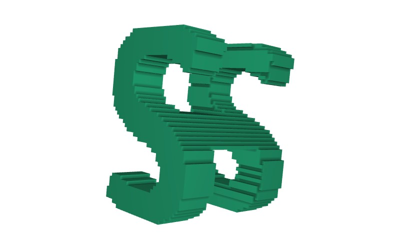
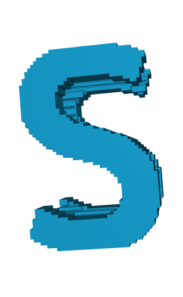
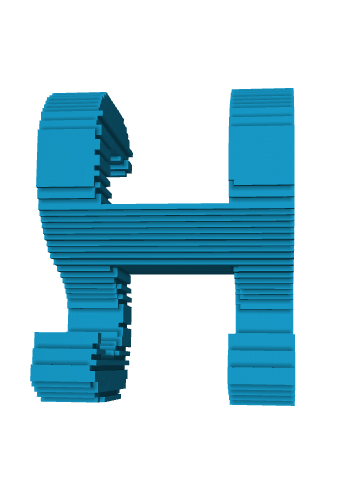

# 3D-ILM: Initial Logo Maker

## Environment

```
numpy
open3d
pillow
```

## Usage

```
python main.py --first S --last H
```





### 3D viewer for .obj file

- [Meshlab](https://www.meshlab.net/)
- [Blender](https://www.blender.org/)
- [Online 3D Viewer](https://3dviewer.net/)
- [Online Voxelizer](https://drububu.com/miscellaneous/voxelizer/?out=obj)

### Note

- Computational time in CPU: about 45s
- Output voxel size: 200x200x200
- You can try your own font by replacing existing `images/*.png` file